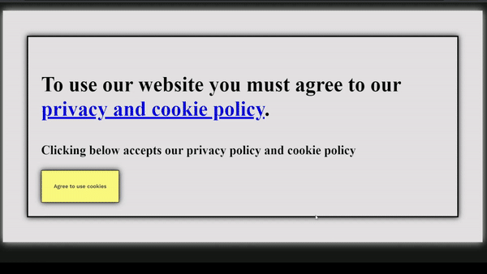
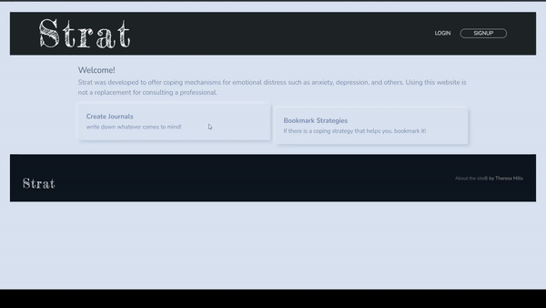

# <h1 align="center">Hi , I'm Theresa</h1>

I love to learn new things and explore different topics. I think this is why I got into programming. It has everything I enjoy like learning something new with a mix of creativity. When I'm not typing away at my keyboard, I enjoy playing guitar and watching documentaries.

      🧠 I'm always learning      👨‍💻 All of my links are here https://linktr.ee/tdev172      📫 How to reach me t.dev0203@gmail.com or tmills172@hotmail.com 

## 🌐 Socials:

 

# 💻 Tech Stack:

            

<h1 align="center">Projects</h1>
<table bordercolor="lightgreen">
  <tr>
      <td width="50%" valign="top">
      <h3 align="center">BakeryDash</h3>
         
        
         
        

          
    
  
      

        
A bakery company that can deliver fresh baked goods to homes BakeryDash

    </td >
      <td width="50%" valign="top"  >
      <h3 align="center">Workout Tracker</h3>
         
        
         
        

          
    
  
      

        
A workout tracker that lets you input your workout and select completed, partially completed, or not completed.

    </td>
  </tr>
  <tr>
      <td width="50%" valign="top">
      <h3 align="center">Strat</h3>
         
        
         
        

          
    
  
      

        
👷Still in development🚧. Strat is a website that provides coping information for emotional distress states. The site is not to replace seeking professional help.

    </td >
</table>

### 😂 Random Dev Meme

